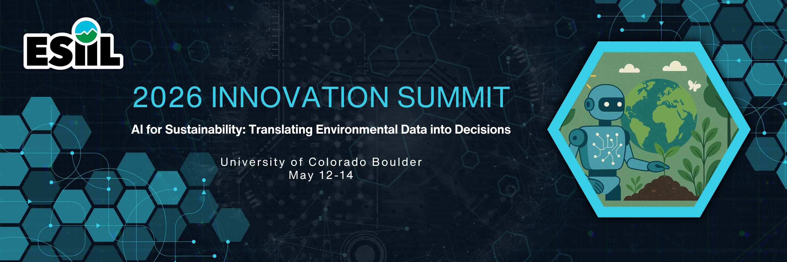
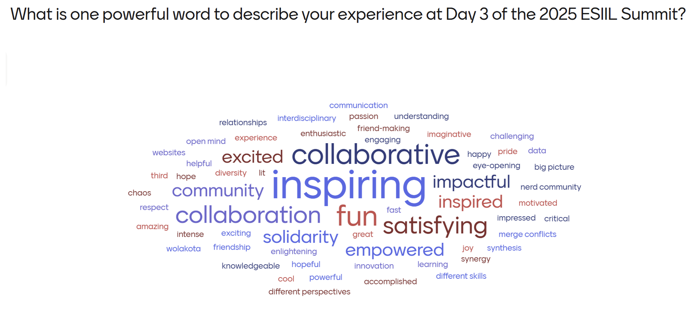

!!! Success "[Click here to apply!](https://docs.google.com/forms/d/e/1FAIpQLSeS0VqeukcKEbONQvf5lsXpOiOc_4BUbw_MnJZVJIk_Su9o7A/viewform?usp=dialog)"

    🗓️ May 12-14, 2026

    📍 University of Colorado Boulder 

# Welcome to the 2026 ESIIL Innovation Summit
## AI for Sustainability: Translating Environmental Data into Decisions
The 2026 [ESIIL](https://esiil.org/) Innovation Summit will focus on **AI for sustainability**, bringing together teams across academic, federal, industry, and non-profit partners to leverage AI and other analytical approaches to generate new discoveries and insights that will help us better steward our nation’s natural heritage. 

We will focus on [**sustainability**](https://www.un.org/en/academic-impact/sustainability), defined by the United Nations as **meeting the needs of the present without compromising the ability of future generations to benefit from and maintain healthy ecosystems over time**. Further, sustainability balances economic development, social fairness, and environmental protection. 

**A key Summit ❓ will be:** _How can we leverage the environmental data and AI revolutions to make decisions over the next 10 years that set our nation’s species, ecosystems, and     environmental livelihoods on a course towards a thriving future?_

On a daily basis we are generating increasingly more data about our living planet, from species to ecosystems, across scales of observation from gene sequencing to drone-based imagery and satellite detections. We need ‘all hands on deck’ to benefit from ideas that come from across sectors, geographies, worldviews, and disciplines to **generate solutions** that span from management scenarios to environmental technologies. Including a spectrum of ideas and voices will **ensure scientific innovations matter and translate across local to national scales**. 

Summit attendees will learn about AI and data methodologies that are available to tackle environmental challenges and how to apply them in their own research and communities. Teams will converge around AI-ready data sets and AI tools.

**[Key focus areas](https://cu-esiil.github.io/Innovation-Summit-2026/virtual-meetings/) include:**

- Co-producing digital twins for environmental futures
- Building Earth embeddings
- AI and causal inference
- Identifying best practices for using large language models in environmental data science.

**Other potential areas include:** emergent combined AI and statistical approaches that enable interpretation of environmental mechanisms, responsible use of AI in environmental data science, and how AI is a challenge and opportunity to advance environmental data sovereignty. 

**Who should apply?** 
The Summit is designed for anyone eager to shape the future of AI-driven environmental discovery. This event is ideal for researchers, practitioners, and decision-makers who work with, or aspire to work with, AI, data science, and large-scale environmental information to advance sustainability. Participants from a range of different sectors, disciplinary expertise, career stage and experience are encouraged to apply.

Throughout the Summit, participants will co-create insights, frameworks, and solutions that support a more sustainable and resilient future.

**[APPLY HERE](https://docs.google.com/forms/d/e/1FAIpQLSeS0VqeukcKEbONQvf5lsXpOiOc_4BUbw_MnJZVJIk_Su9o7A/viewform?usp=dialog)** by January 31, 2026

## Goals

- **Inspire** novel AI approaches that unlock the potential of environmental data
- **Grow** AI and data skills capabilities in the next-generation workforce
- **Build** transdisciplinary collaborations and emergent teams across sectors to facilitate data-driven co-development
- Learn, workshop, and create **best practices** in environmental data science and the responsible use of AI

        

## Summit Features

-   :material-database:{ .feature-ico } **Big Data & Cyberinfrastructure**  
    Access cutting-edge AI and data analysis tools to explore sustainability solutions.

-   :material-account-group:{ .feature-ico } **Collaborative “Unconference”**  
    Flexible, participant-driven sessions where attendees shape their own experience, collaborate on inspiring projects, and foster innovation.

-   :material-laptop:{ .feature-ico } **Hands-On Learning & Strategy**  
    Workshops and discussions to leverage AI tools for developing sustainability solutions.
    
-   :material-scale-balance:{ .feature-ico } **Team Science & Ethical Open Science**  
    Deepen your understanding of team science, ethical practice, and leadership in environmental data science.

## What to Expect at the Summit
The Summit will take the form of an **‘unconference’**, a flexible and interactive event designed to foster **collaboration and innovation**. Attendees are encouraged to participate in discussions, workgroups, and brainstorming sessions centered around the themes that interest them most. The format encourages **co-creation** of solutions, with ample opportunities for spontaneous interactions and cross-disciplinary teamwork.

What past attendees had to say:

- “The ESIIL Innovation Summit brings together people… to gain hands-on experience developing innovative science questions, big data tools, and working in a collaborative team.”
- "I had a fantastic time at the summit making new connections and learning new environmental data science techniques and research topics that has only increased my passion for EDS and interest in participating in an ESIIL working group. The inclusive environment that ESIIL and the Divergent Science team created played a big part in that. Thank you and I’m so grateful for being a part of this summit!”
- “Get ready to work hard and to grow. You’ll meet a lot of great people from diverse backgrounds.”
- “A highlight of the Summit was the general atmosphere and community. There’s palpable excitement. The unconference format is different from a typical conference, so people don’t always know what to expect—but that’s part of what makes it so engaging.”
- “I see solutions that I did not see before the Summit. I see possibilities for collabs I probably would not have encountered without the Summit."

## Training Opportunities
To prepare for the theme and goals of the Summit, all attendees will be invited to virtual training and networking opportunities prior to the event. Details about our key themes and pre-event training events can be found on our ["Pre-Summit Trainings" page](https://cu-esiil.github.io/Innovation-Summit-2026/virtual-meetings/) 🔝. **Virtual opportunities may include:**

* Technical trainings in cloud computing (CyVerse and Github)
* Networking opportunities around the Summit theme
* Earth Embeddings: Introduction to Earth embeddings and encoding earth data into vector representations
* Digital Twins: AI and CI tools for continental-scale near-real-time data stream, predictions, and forecasting systems
* LLMs for robust application in environmental sciences
* AI for causal inferences
* Team science, community building and collaboration

## Who Should Attend? 
The **2026 ESIIL Innovation Summit** aims to bring together participants who are eager to shape the future of AI-driven environmental discovery. The Summit will focus on identifying opportunities for data synthesis, exploring the cutting-edge capabilities of AI, and fostering innovative sustainability solutions through collaborative teams. Whether your expertise lies in environmental science, computer science, management, or community engagement, this event will offer valuable insights and the chance to collaborate with others from a variety of sectors. We encourage applications from individuals across all career stages and disciplines. 

**Registration:** Accepted applicants will be sent a confirmation from to confirm their attendance.

**Finances:** There is no registration fee for accepted participants to attend the Innovation Summit or associated trainings and workshops. A limited number of travel awards of up to $1,200 are available to help defray airfare/mileage and accommodation costs. Simple snacks, beverages, and lunch will be provided during the event. 

## Venue Information
The Innovation Summit will be held at the University of Colorado Boulder East Campus [SEEC Building](https://seec.colorado.edu/home), **C120 Auditorium**. 
The address is 4001 Discovery Dr, Boulder, CO 80303. Click [here](https://seec.colorado.edu/getting-here/directions) for directions to the SEEC Building.

Click [here](https://seec.colorado.edu/system/pdfs/first_floor.pdf) for a map of the SEEC Building's 1st floor. The C120 auditorium is located at the main entrance, directly south of the [Triceratops](https://www.colorado.edu/today/2024/01/16/full-triceratops-skeleton-now-calls-boulder-home).

*SEEC and SEEL Buildings*

### Building Resources

* [SEEC Cafe](https://seec.colorado.edu/resources/seec-cafe)
* ADA single stall restrooms off the North and South Atriums 
* Lactation room [S120](https://seec.colorado.edu/resources/lactation-room) or wherever comfortable
* Quiet areas
* Elevators, accessible entrances, and more inclusivity resources on the campus map:  https://www.colorado.edu/map/
* ESIIL Refrigerator 
* Meeting resources
* Meeting supplies
* Health supplies

***Let us know if you need something to be able to participate comfortably.***

### Venue Parking
For those who will need to park a vehicle on campus to attend the Summit, we will provide a form in May to receive a parking permit and voucher code. Note that due to University policy, University of Colorado employees and students are not allowed to use this voucher code.  Follow the permit instructions to claim your $0 permit. Guests only need to claim one permit for the week as it will last from 05/11-05/14. 

### Health & Safety Resources
* Campus and Off-Campus Emergencies 911
* CU Police Department (On-Campus, Non-Emergency) 303-492-6666
* City of Boulder Police Department (Non-Emergency) 303-441-3333
* Boulder Community Hospital 303-415-7000: 4747 Arapahoe Ave, Boulder, CO 80303

### Internet Access
*Step 1: Request Guest Wi-Fi Credentials*
- Open your device's Wi-Fi networks and select CU Guest.
- On the CU Guest login page, click Register for CU Guest.
- On the registration page, enter your contact information, accept the terms of service, and click Register.
- A confirmation page will indicate that your guest Wi-Fi credentials were sent to the email account you provided.
- Check your email for a new message from CU Boulder Campus Wi-Fi (wifi_noreply@colorado.edu) with your temporary guest Wi-Fi credentials.

*Step 2: Log in to CU Guest Wi-Fi*
- On the CU Guest login page, enter the guest username and password provided to you, then click Log in to CU Guest.
- On first login only: For security purposes, guests are required to change their password upon first login. New passwords must be at least eight characters long and use a combination of uppercase letters, lowercase letters and numbers. Record the password in a secure location, then click Change Password.
- A confirmation page will indicate that you've logged in successfully and recommend checking your connection to CU Guest Wi-Fi. If your device isn't connected, follow the troubleshooting steps on the page.
- Guests are required to log in daily. Guest credentials remain active for seven days and can be used on up to three different devices.

If you encounter difficulty accessing the Internet, call 303-735-HELP (4357) or email help@colorado.edu for assistance during their business hours. Check firewalls or security settings on your computer that could possibly complicate accessing the campus Wi-Fi system before you arrive.

## Hotels
We have a negotiated rate at a nearby hotel. Please book by April 10, 2026 to receive this negotiated rate. 

### [Homewood Suites](https://www.hilton.com/en/hotels/boucohw-homewood-suites-boulder/)
* Address:4950 Baseline Rd., Boulder, Colorado, 80303
* $173/night
* Booking link [HERE](https://www.hilton.com/en/book/reservation/deeplink/?ctyhocn=BOUCOHW&groupCode=CHWIPO&arrivaldate=2026-05-11&departuredate=2026-05-15&cid=OM,WW,HILTONLINK,EN,DirectLink&fromId=HILTONLINKDIRECT)

In addition, CU Boulder has set negotiated rates with hotels all around Boulder and the surrounding area, which should provide some different options depending on your budget. When booking with one of these hotels [(instructions on the site)](https://www.cu.edu/preferred-hotel-program-local/preferred-hotel-program-local-ucb), note that you need to mention “The University of Colorado special rate” and that you will be staying for a university-sponsored event. 

## Event Photography
We plan to take some photos of activities throughout the course of the week for use in internal and external publications. If you do not wish to have your image recorded for distribution, please inform the photographer and/or email Casey.Jenson@colorado.edu. By participating in ESIIL events, you are agreeing to the use of your photos unless you notify us in writing of your desire to opt out of being photographed. 

## Weather and Packing
Boulder is 5,430 feet in elevation and has a sunny, semi-arid climate. Hydrating during your stay is very important, as altitude sickness (headache, nausea, shortness of breath, dizziness, and tiredness) can occur.

Weather conditions can change rapidly throughout each day and from day to day. Layers are always a good choice.

The average temperature in Boulder in May for a typical day ranges from a high of 65-70F to a low of 35-45F. Some would describe the temperature to be moderately chilly. The general area may also feel breezy. The sun is strong in Boulder, so please bring sunscreen, sunglasses, and a hat. There are many trails near Boulder, so hiking or running shoes and a set of workout clothes can help get you outside during your stay.

## Transportation

### Air Transportation
If you are flying in for the event you will want to fly into the Denver International Airport (DIA). Note that the airport is quite large and you will need to take an airport train to the main terminal.

### Ground Transportation
**Ride Share**
A Lyft or Uber or airport taxi are the most expensive option but also the most direct way to get from the airport to Boulder (often $70 or higher one way).

**Public transportation to/from airport**
Transit from the Denver airport to Boulder is quite easy via the **AB1 Boulder/Denver** airport bus. This bus runs at least once an hour during the day, with more frequent trips at popular times. To locate the bus, follow signs in the Denver airport baggage claim area to ‘Train to city,’ which will lead you down an escalator. At the base of the escalator, instead of continuing straight towards the visible train station, turn left and you should see a bus terminal with an RTD ticket machine. Tickets for the AB1 can be purchased for $10. Find the gate for the AB1 / Downtown Boulder line.

**Airport Shuttle Services**
If you would prefer to book a shuttle to/from DIA (Denver International Airport) & Boulder:

* SuperShuttle: www.supershuttle.com 800-258-3826

**Car Rentals**
There are a number of rental car agencies located at the Denver International Airport:

* Advantage: www.advantage.com
* Alamo: www.alamo.com
* Avis: www.avis.com
* Budget: www.budget.com
* Dollar: www.dollar.com
* Enterprise: www.enterprise.com
* Hertz: www.hertz.com
* National: www.nationalcar.com
* Payless: www.paylesscarrental.com

**Additional car rental options include:**

* eGo CarShare
* Zipcar

### Transportation around the Boulder area
Boulder has a number of public transportation options for traversing Boulder and the surrounding area

**Bus lines**
[Information about Boulder’s local bus network can be found here](http://www.bouldercolorado.gov/goboulder/bus). Note that the Skip, Bound, and Hop lines pass campus regularly.

If you need to travel to Denver for any reason, the [Flatiron Flyer](https://www.rtd-denver.com/services/flatiron-flyer) bus connects Denver to Boulder. Currently the FF1 is the best option, and connects Denver’s Union Station to the Downtown Boulder Station (with numerous stops in-between).

**Biking & Walking**
Boulder has an extensive system of city walking/biking paths; [maps can be found here](https://bouldercolorado.gov/services/multi-use-paths). [Boulder B-Cycle](https://boulder.bcycle.com/nav/start-riding) is a community non-profit bike sharing system with daily and month passes available.

## 

*This event is hosted by ESIIL and funded by the National Science Foundation (via award # DBI-2153040), and subject to the NSF’s terms and conditions.

